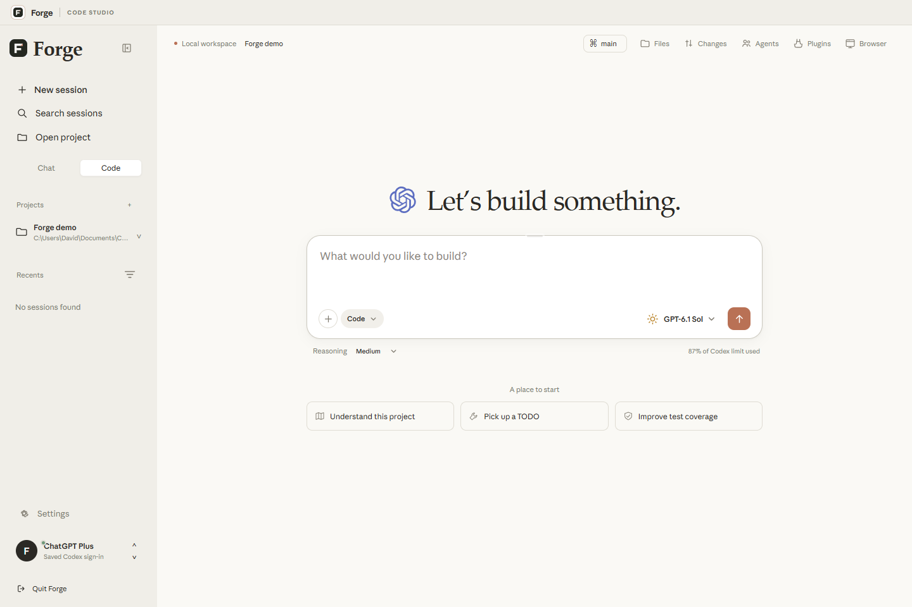
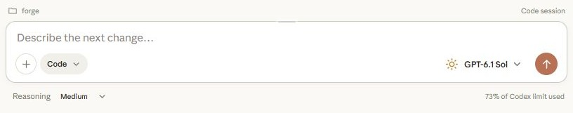
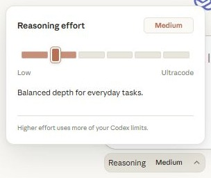
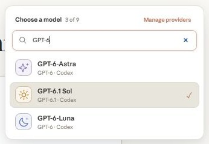
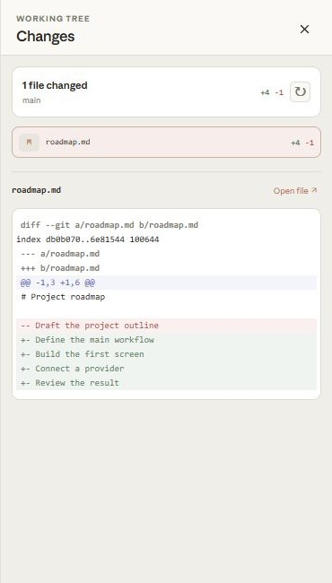
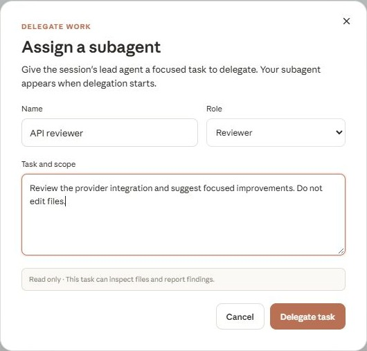

# Forge

[Visit the Forge website](https://ahpah-dev.github.io/forge-codex-workspace/) · [Download for Windows](https://github.com/ahpah-dev/forge-codex-workspace/releases/latest) · [MIT license](LICENSE)

Forge is a free, MIT-licensed desktop AI workspace for Codex, Claude Code, and external APIs such as OpenRouter and NVIDIA. It includes a project browser, file changes, terminal activity, approval prompts, live agent task summaries, and image and file attachments through drag and drop or the file picker. Codex uses the account already signed in on this Windows user profile and its standard model catalog and rate limits. Claude Code and custom providers use their own accounts and access.

## Screenshots

Screenshots show the v1.0.49 interface, using a demo project and generic task examples.

During coding, the composer becomes compact and stays at the bottom of the session:

| Reasoning controls | Model selection |
| --- | --- |
|  |  |

| Working tree diffs | Assigning a subagent |
| --- | --- |
|  |  |

## Windows app

File edits appear in expandable code cards with line numbers and additions/removals. While a task is running, **Follow code** keeps the latest patch lines visible; scroll up to pause following. Claude Write/Edit inputs stream during generation. Codex and external providers show patches whenever their runtime exposes them, so some edits arrive as a complete patch rather than character by character. Proposed edits are not marked as applied until the tool finishes.

Drop images or files onto the composer, or use its attachment button. Images show previews. Other files are copied into `.forge-attachments` inside the selected project when sent, so the model can open them with the project tools. Attach up to four images and four other files at a time; each attachment can be up to 5 MB.

Download the latest Windows x64 installer from [GitHub Releases](https://github.com/ahpah-dev/forge-codex-workspace/releases/latest). Run the installer, then launch Forge from the Start menu or desktop shortcut. Sign in to Codex once in the Codex app or Codex CLI; Forge uses that saved local account automatically.

To build the installer yourself, use Node.js 24.15 or newer on Windows x64, run `npm install`, then `npm run dist:win`. The installer is written to `release/Forge-Setup-1.0.55-x64.exe`. The desktop app bundles its Codex runtime and does not need a global Node.js install.

## Start from source

1. Install Node.js 18 or newer.
2. Sign in to Codex with your ChatGPT account in the Codex app or CLI.
3. Run `start-forge.cmd` to launch the browser version. It installs Forge's pinned Codex CLI on first run.
4. Choose a project folder in Forge.

For local desktop development, run `npm install` and `npm run desktop`. `npm start` launches the browser version.

## Providers and accounts

**FlagshipRouter:** Choose **Manage providers → FlagshipRouter**, use your local gateway URL (default `http://127.0.0.1:20128/v1`) and the key from its Endpoint & Key page, then **Load models** and save. Forge uses its Chat Completions adapter to preserve Codex tool names, namespaces and free-form execution inputs. Catalogs retain up to 500 tool-capable models. Existing local FlagshipRouter connections using Automatic are recognized on startup. Connect upstream accounts in the router dashboard; advertised models still require available access and quota. Forge keeps your saved ChatGPT sign-in. Stale OpenCode entries are checked against its live public catalog. An unavailable or protocol-incompatible free route can fall back to another current OpenCode free model through the same gateway before output starts; Forge remembers the working route for that chat. Authentication and quota errors are not masked, and partial output is never replayed on another model.

**OpenAI / Codex:** Forge reads the connected account's model catalog and usage limits. GPT-6 model availability and rate limits follow the signed-in Codex account and its standard plan allowance.

Enable **Automatic model routing** in Settings to select a GPT-6 model per task using a local prompt-complexity heuristic. GPT-6 Luna is the default for most requests, GPT-6.1 Sol handles substantial multi-part tasks, and GPT-6 Astra is reserved for rare, exceptionally broad first prompts. Auto routing never selects GPT-5.6 and makes no extra model request. Manually selected Claude and custom providers remain under your control.

**Anthropic / Claude Code:** Install the official [Claude Code CLI](https://code.claude.com/docs/en/setup), open **Manage providers**, and choose **Connect**. Forge uses the local Claude Code Agent SDK runtime and its saved Claude sign-in; sign in separately from ChatGPT. Claude model aliases select the latest Opus, Sonnet, or Haiku available to that CLI. Anthropic currently allows third-party Agent SDK usage to draw from Claude plan limits; the same plan usage limits apply. See [Anthropic's subscription and Agent SDK guidance](https://support.claude.com/en/articles/15036540-use-the-claude-agent-sdk-with-your-claude-plan).

**Google AI Pro:** Forge cannot sign in with a Google AI Pro subscription. Google's Gemini CLI subscription OAuth is restricted to Google's own client and must not be used by third-party apps. See [Google's Gemini CLI terms](https://github.com/google-gemini/gemini-cli/blob/main/docs/resources/tos-privacy.md). Google AI Studio or Vertex API access is separate from an AI Pro subscription; Forge's custom provider path requires an API key and a compatible Responses or Chat Completions endpoint.

Use **Manage providers** to add OpenRouter, NVIDIA NIM, or another service that supports Chat Completions or the Responses API. NVIDIA and OpenRouter use the local Chat Completions adapter automatically; other services can select their API format explicitly. The adapter forwards tool schemas, strictness, tool choice, tool results, and supported parallel-call settings, including streamed or non-streamed Chat Completions. Large Chat Completions tool catalogs use at most 128 active definitions, with file and shell tools prioritized and other plugin functions discovered on demand. Groq uses a smaller catalog and schema budget to leave room for its free-plan allowance. Codex still executes the tools with the session's workspace and approval settings. For coding tasks, choose a model that supports tool calling. Provider keys are encrypted with Windows DPAPI in the current user's local Forge data and are not written to `settings.json` or the Codex config file. Requests through external providers use that provider's billing, policies, and limits; they do not use the ChatGPT Codex allowance. ChatGPT remains signed in when other providers are used.

**Default providers:** The model picker has **9router · Default free** and **Codex · Default paid** shortcuts. New installations start with Codex; an existing model selection remains remembered. The free shortcut uses your preferred 9router route and opens the connection panel until one is ready. Changing providers starts a new session when necessary, preserving the old conversation and your Codex sign-in.

**9router:** Open **Manage providers → 9router → Connect & load models**. Forge installs and starts its local gateway, provisions its own connection key, reuses your saved Kilo, Groq, OpenRouter and NVIDIA routes through authenticated local proxies, and creates **Auto · saved free providers**. Upstream keys remain in Forge's encrypted store. Models are loaded and saved automatically; both coding combos and individual models from connected providers appear in the picker. Empty installations do not import 9router's unavailable static fallback catalog. Choose a preferred free model from the dropdown, then click **Use 9router**; the preference is saved automatically. No manual combo creation or gateway-key copying is needed for Forge's managed instance. **Advanced connection** supports an existing local gateway, gateway API key, and manually entered IDs. External gateways still require whatever authentication and providers they are configured to use. The managed gateway runs on port 20129, separate from OmniRoute, and stops with Forge. Its free route uses the eligible saved free integrations and their normal quotas; NVIDIA and Groq account billing still follows your own account terms. No arbitrary paid endpoint is added automatically. The dashboard remains available for additional upstreams and configuration. See the [official 9router project](https://github.com/decolua/9router).

**OpenRouter Free Auto Route:** In Settings, enable the route and enter OpenRouter and NVIDIA NIM API keys. Forge discovers OpenRouter's current catalog and picks an eligible tool-capable model with zero input, output, and other listed prices, preferring stronger coding benchmark results. OpenRouter can still reject a nominally free model when provider capacity or account limits are exhausted; Forge then tries NVIDIA NIM models using your NVIDIA key and account quota. NVIDIA model availability, throughput, and any charges follow NVIDIA's current account terms. For Codex limit fallback, separately enable **Use free routing when Codex is rate limited**. Forge carries the visible conversation into a linked provider session only when a new response cannot start because Codex reports a rate limit. This does not increase Codex limits or make paid external services free.

**Plan mode:** Choose **Plan** beside the composer mode selector to ask for a read-only investigation and implementation plan. Switch back to **Code** to make changes.

**Groq Free:** In **Manage providers**, select **Groq Free**, paste a key from [Groq Console](https://console.groq.com/keys), and save. The native preset fills the endpoint and coding models: GPT-OSS 120B, Qwen 3.8 27B, and GPT-OSS 20B. **Load models** refreshes these choices against your authenticated catalog and excludes inactive or unrelated speech/moderation models. Structured tool calls use Forge's existing executor for files, shell, browser, and questions; GPT-OSS uses sequential tool calls as required by Groq. The free plan has [token and request limits](https://console.groq.com/docs/rate-limits), and long coding sessions may exceed them. Forge respects short minute-level cooldowns with at most two waits totaling about one minute, before any output, and reduces an oversized output reserve once when the reported budget permits. It preserves the full conversation and instructions; conversations that still exceed the allowance stop with an error. Groq does not expose your billing plan in the model catalog, so a paid account follows its own billing. ChatGPT stays connected and Groq uses its own quota.

**Codex plugins:** Open **Plugins** to search the directory, manage installed plugins, and refresh marketplace sources. Choose **Setup** on an installed plugin to see its skills, MCP servers, and account connections. Vercel and other connected apps show their actual callable state; connect missing accounts or enable disabled connections from the panel, then refresh. Forge includes a plugin's connected app mentions when you use `@plugin`, and supports plugin forms and URL sign-in requests during tasks. These plugins work with Codex and its external API providers; Claude uses its separate runtime. Start a new session after installing or enabling a plugin. Capabilities that require the original Codex desktop host, including special verification flows, still need that host.

**In-app browser:** The Windows desktop browser opens alongside chat, with a draggable panel edge, an expand button, and live action feedback. Returning to chat leaves its page and tools running. Computer-use actions use native clicks, typing, and incremental pointer/scroll input; screenshots match the viewport coordinates. Forge's browser configuration adds its MCP server without replacing your other configured servers.

**Computer-use connection:** Forge desktop has its own Windows controller, separate from the Codex desktop plugin's connected-app inventory. Models can call `computer_use_connection` to inspect the native helper, Windows windows, displays, and Forge browser pages, including precise errors and recovery guidance. An empty app or tab list does not prevent opening a requested folder in File Explorer with `computer_use_open` or creating a browser page with `browser_open`. External Chrome/Edge windows use the desktop tools; `browser_tabs` lists Forge's embedded pages only. These recovery instructions apply to Codex, custom providers, and Claude. Native desktop input requires the Windows desktop app; the browser-only server supplies browser tools.

## Workspace and appearance

**OmniRoute Local:** Select **Manage providers → OmniRoute Local → Install & start**. Forge downloads the pinned [OmniRoute](https://github.com/diegosouzapw/OmniRoute) gateway into its own local data folder, starts it on `127.0.0.1:20128`, and displays installation/connection progress. The initial installation needs internet access and several hundred MB of disk space; the desktop app includes its installer/runtime, so no global Node/npm setup is needed. Choose **Open dashboard** to connect your upstream free providers, then **Add provider** in Forge. An API key is optional unless you enable gateway authentication; keys you enter are encrypted in Forge's Windows secure store. The defaults are `auto/coding:free` and `auto/fast:free`; the managed gateway stops with an error if its free pool is empty rather than falling back to paid models. Free routes still require an available upstream and retain upstream quotas/access restrictions. Changing route IDs or adding paid account configurations can incur provider charges. Your ChatGPT sign-in remains connected. Forge restarts its installed gateway when needed and stops only its own gateway on exit; an already running local instance is reused without taking ownership. Source builds need a Node version supported by OmniRoute: 22.22.2 through 22.x, 24.x (24.15+ for bundled npm), 25.x, or 26.x.

**Accessible free-route fallback:** OpenCode's free models can reject external clients, including Forge. If an OmniRoute free auto alias encounters that restriction, an unavailable upstream, invalid credentials, a quota error, or an error before output begins, Forge tries the compatible Kilo, OpenRouter, Groq, and NVIDIA integrations whose keys you have already saved. OpenRouter uses its current zero-price, tool-capable catalog and enforces zero-price routing. Other services retain their own account quotas and billing rules. Forge displays the actual fallback, remembers a responding route briefly, and cools down failed routes. It never replays partial output, switches a specifically selected model, or copies your saved keys into OmniRoute. If no configured route works, it asks you to update a provider key or connect an accessible upstream in the dashboard. The desktop dashboard button opens the local gateway in your Windows browser and starts an installed gateway when needed.

**Kilo Free Router:** Select **Manage providers → Kilo Free Router**, then paste your Kilo Gateway key from [Your Profile at app.kilo.ai](https://app.kilo.ai/) and save. This hosted integration needs one key and no local router installation. It uses only `kilo-auto/free`; Kilo selects underlying models from its current curated free pool. The native preset locks the endpoint/model, validates those restrictions when saving and making requests, and keeps its free-only setting after restarting Forge. **Load models** checks that the live route has zero prompt/completion price and supports tools. File, shell, browser, and question calls run through Forge's existing executor. Your ChatGPT login remains connected. Availability and upstream rate limits apply; failures do not switch to a paid Kilo tier. Auto Free may route code to providers that log prompts and outputs for improvement; see [Kilo's free usage and data terms](https://kilo.ai/docs/getting-started/using-kilo-for-free). Kilo's [coding client is open source](https://github.com/Kilo-Org/kilocode); this integration uses its hosted gateway, not a self-hosted router.

Drag the grip at the top of the chatbox to adjust its text area height, or focus the grip and use the arrow keys. Double-click it (or press Home/Enter) to restore automatic height. **Settings → Chatbox** saves your preferred height and Rounded, Pill, or Square shape on this device.

Forge opens the Windows folder picker in the desktop app. The browser version accepts a local folder path. Official Codex models run with full file-system and network access and do not pause for approval; use Ask or Plan mode for read-only work. External models ask before extra access by default. Change this in Settings under **External model permissions**.

The sidebar can be resized or hidden, and its state is remembered. Open the gear button to customize colors, background, interface scale, conversation and code fonts, and line spacing.

Anthropic Sans uses local Roman and italic WOFF2 assets with proper font MIME types. The default font no longer depends on a CDN request or an internet connection. Existing custom font choices stay intact; select Anthropic Sans in Settings to use it. Third-party font attribution is in `public/fonts/NOTICE.md`.

While a task runs, Forge shows concrete activity from command, file, search, tool, plan, and delegated-agent events. The Agents panel groups session subagents by progress, attention, and completion, with search and jump-to-activity navigation. Claude subagents display their task and short progress summaries; Forge does not expose private chain-of-thought. Permission requests appear as reviewable cards with allow and decline actions.

Hover a prompt to edit it, retry it, or **Revert to here**. Editing and retrying rerun the prompt in a new conversation branch, and Revert opens a branch before that prompt while keeping the original chat. These actions rewind conversation history only; they do not undo changes already made to project files.

Open **Agents → Assign task** to provide a subagent name, role, and task scope. Forge asks the session's lead agent to delegate the task using the runtime's agent tools; the roster shows agents only after real delegation events arrive. Reviewer and Explorer assignments run with read-only permissions. Select an agent to view its full task and latest update, pin it for quick access, or jump to its activity in the conversation. Pins persist locally. Automatic model routing evaluates the assigned task's complexity.

The top **Files**, **Changes**, and **Agents** controls open their respective tool panels; clicking the selected control closes the panel. Use **Ctrl+Shift+1**, **Ctrl+Shift+2**, and **Ctrl+Shift+3** to toggle them from the keyboard. Panels adapt to desktop and narrow windows.

The Changes panel summarizes modified files and Git line totals. Select a file to inspect its diff, including staged and unstaged edits, deleted files, and untracked text files, or open its source in Files. Use the refresh control to pick up external edits. File activity cards show per-file additions and removals when Git can calculate them.

Assistant Markdown renders local workspace file links as compact clickable chips that open the file in Forge's preview pane, including paths containing spaces or parentheses.

## Browser verification

The Windows desktop app provides host-level computer-use tools for Codex, Claude, and configured Codex-runtime models. They can inspect screenshots and use the real desktop pointer and keyboard in other Windows apps, with screenshot-based coordinates. Ask the model to inspect the screen before it acts. Browser-specific tasks can still use Forge's visible in-app browser, which has a persistent profile. The browser-based version uses its bundled isolated Chromium browser and does not control the Windows desktop.

Desktop agents can list open window handles, restore/focus an app, and open absolute app/file/folder paths or URLs in your default browser. `browser_open` reveals the embedded browser; `browser_tabs` lists and selects real popup pages, including login windows. Codex receives these tools at runtime startup and thread resume. Browser navigation waits for a usable document and reports failures; crashed pages and timed-out desktop helpers can recover on the next request. Windows can still block input to elevated apps or secure desktop prompts, and some sites restrict embedded-browser sign-in.

For source builds, run `npm run browser:install` to install the pinned browser runtime. Windows packaging runs this step automatically.

## Local data

The web server listens only on `127.0.0.1`. In the packaged app, Forge settings and encrypted provider keys are stored under the Windows user application-data folder; the browser version stores settings in `data/`. Project files are read and edited in the selected folder. Codex and Claude Code manage their own account authentication.

Forge is an independent local interface. It is not an official OpenAI, Anthropic, or Google application.
