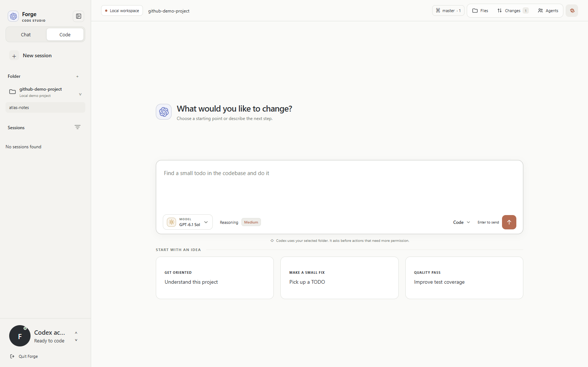
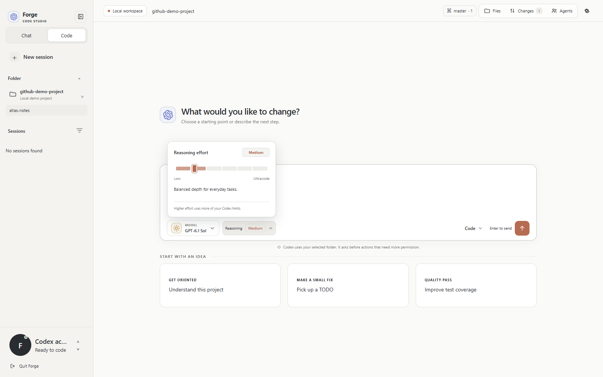
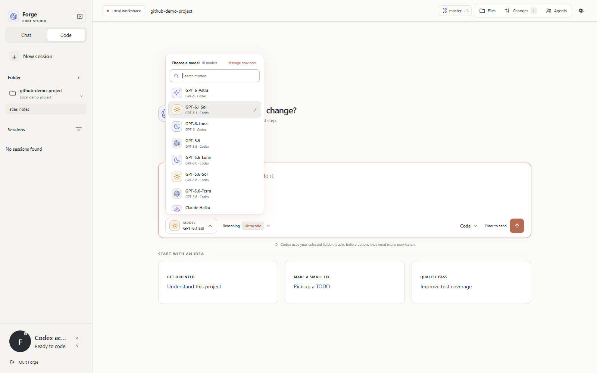
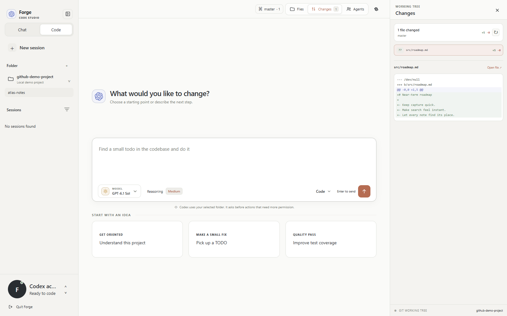
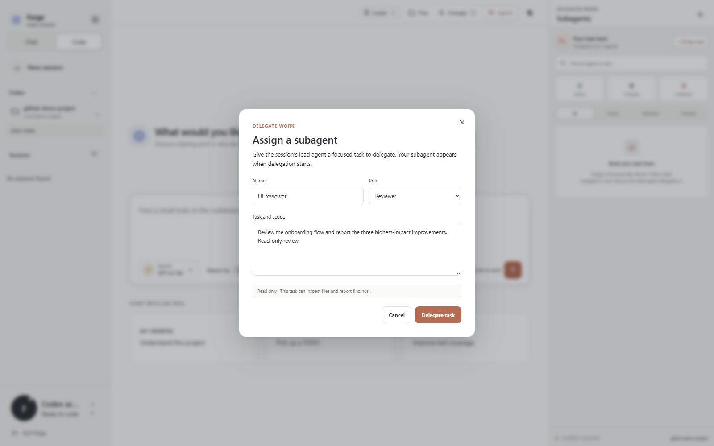

# Forge

[Visit the Forge website](https://davidegeric-cloud.github.io/forge-codex-workspace/) · [Download for Windows](https://github.com/davidegeric-cloud/forge-codex-workspace/releases/latest) · [MIT license](LICENSE)

Forge is a free, MIT-licensed desktop AI workspace for Codex, Claude Code, and external APIs such as OpenRouter and NVIDIA. It includes a project browser, file changes, terminal activity, approval prompts, and live agent task summaries. Codex uses the account already signed in on this Windows user profile and its standard model catalog and rate limits. Claude Code and custom providers use their own accounts and access.

## Screenshots

Screenshots use a local demo project with generic account details.

| Reasoning controls | Model selection |
| --- | --- |
|  |  |

| Working tree diffs | Assigning a subagent |
| --- | --- |
|  |  |

## Windows app

Download the latest Windows x64 installer from [GitHub Releases](https://github.com/davidegeric-cloud/forge-codex-workspace/releases/latest). Run the installer, then launch Forge from the Start menu or desktop shortcut. Sign in to Codex once in the Codex app or Codex CLI; Forge uses that saved local account automatically.

To build the installer yourself, use Node.js 18 or newer on Windows x64, run `npm install`, then `npm run dist:win`. The installer is written to `release/Forge-Setup-1.0.7-x64.exe`. The desktop app bundles its Codex runtime and does not need a global Node.js install.

## Start from source

1. Install Node.js 18 or newer.
2. Sign in to Codex with your ChatGPT account in the Codex app or CLI.
3. Run `start-forge.cmd` to launch the browser version. It installs Forge's pinned Codex CLI on first run.
4. Choose a project folder in Forge.

For local desktop development, run `npm install` and `npm run desktop`. `npm start` launches the browser version.

## Providers and accounts

**OpenAI / Codex:** Forge reads the connected account's model catalog and usage limits. GPT-6 model availability and rate limits follow the signed-in Codex account and its standard plan allowance.

Enable **Automatic model routing** in Settings to select a GPT-6 model per task using a local prompt-complexity heuristic. GPT-6 Luna is the default for most requests, GPT-6.1 Sol handles substantial multi-part tasks, and GPT-6 Astra is reserved for rare, exceptionally broad first prompts. Auto routing never selects GPT-5.6 and makes no extra model request. Manually selected Claude and custom providers remain under your control.

**Anthropic / Claude Code:** Install the official [Claude Code CLI](https://code.claude.com/docs/en/setup), open **Manage providers**, and choose **Connect**. Forge uses the local Claude Code Agent SDK runtime and its saved Claude sign-in; sign in separately from ChatGPT. Claude model aliases select the latest Opus, Sonnet, or Haiku available to that CLI. Anthropic currently allows third-party Agent SDK usage to draw from Claude plan limits; the same plan usage limits apply. See [Anthropic's subscription and Agent SDK guidance](https://support.claude.com/en/articles/15036540-use-the-claude-agent-sdk-with-your-claude-plan).

**Google AI Pro:** Forge cannot sign in with a Google AI Pro subscription. Google's Gemini CLI subscription OAuth is restricted to Google's own client and must not be used by third-party apps. See [Google's Gemini CLI terms](https://github.com/google-gemini/gemini-cli/blob/main/docs/resources/tos-privacy.md). Google AI Studio or Vertex API access is separate from an AI Pro subscription; Forge's custom provider path requires a Responses API endpoint and an API key, so it only works with services that provide that interface.

Use **Manage providers** to add OpenRouter, NVIDIA NIM, or another service that supports the Responses API. Provider keys are encrypted with Windows DPAPI in the current user's local Forge data and are not written to `settings.json` or the Codex config file. Requests through external providers use that provider's billing, policies, and limits; they do not use the ChatGPT Codex allowance. ChatGPT remains signed in when other providers are used.

## Workspace and appearance

Forge opens the Windows folder picker in the desktop app. The browser version accepts a local folder path. Code mode can edit files in the selected workspace; requested access outside it can require your approval. Chat mode defaults to read-only.

The sidebar can be resized or hidden, and its state is remembered. Open the gear button to customize colors, background, interface scale, conversation and code fonts, and line spacing.

While a task runs, Forge shows concrete activity from command, file, search, tool, plan, and delegated-agent events. The Agents panel groups session subagents by progress, attention, and completion, with search and jump-to-activity navigation. Claude subagents display their task and short progress summaries; Forge does not expose private chain-of-thought. Permission requests appear as reviewable cards with allow and decline actions.

Open **Agents → Assign task** to provide a subagent name, role, and task scope. Forge asks the session's lead agent to delegate the task using the runtime's agent tools; the roster shows agents only after real delegation events arrive. Reviewer and Explorer assignments run with read-only permissions. Select an agent to view its full task and latest update, pin it for quick access, or jump to its activity in the conversation. Pins persist locally. Automatic model routing evaluates the assigned task's complexity.

The top **Files**, **Changes**, and **Agents** controls open their respective tool panels; clicking the selected control closes the panel. Use **Ctrl+Shift+1**, **Ctrl+Shift+2**, and **Ctrl+Shift+3** to toggle them from the keyboard. Panels adapt to desktop and narrow windows.

The Changes panel summarizes modified files and Git line totals. Select a file to inspect its diff, including staged and unstaged edits, deleted files, and untracked text files, or open its source in Files. Use the refresh control to pick up external edits. File activity cards show per-file additions and removals when Git can calculate them.

Assistant Markdown renders local workspace file links as compact clickable chips that open the file in Forge's preview pane, including paths containing spaces or parentheses.

## Local data

The web server listens only on `127.0.0.1`. In the packaged app, Forge settings and encrypted provider keys are stored under the Windows user application-data folder; the browser version stores settings in `data/`. Project files are read and edited in the selected folder. Codex and Claude Code manage their own account authentication.

Forge is an independent local interface. It is not an official OpenAI, Anthropic, or Google application.
